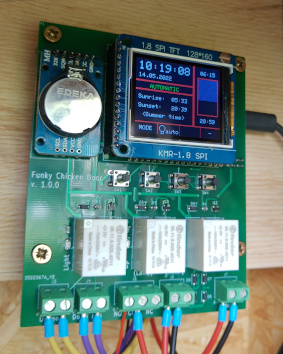
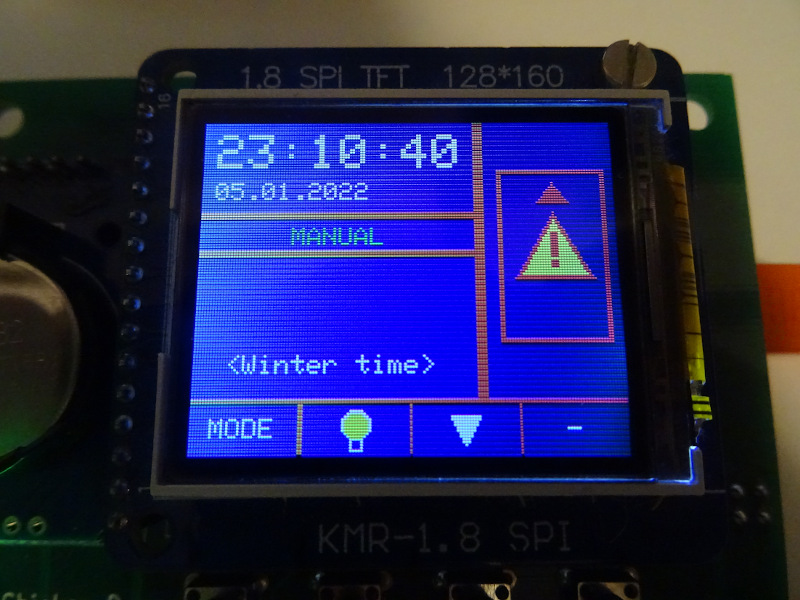
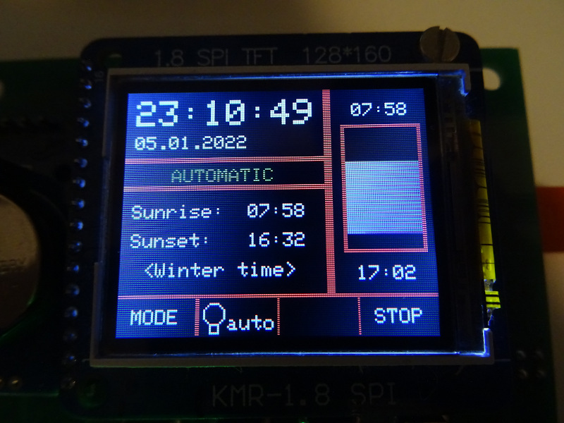

# Chickendoor
The idea behind the project is to provide a chicken-house-door-controller with simple and easy available components. Opening and closing times (plus additional features) are based on local times for sunrise and sunset. The software is based on the Arduino framework and is written 100% in 'bare-bone' C++.\
If you can need the software, use it for your private stuff. For commercial use we need to have a talk first.
In case of problems, errors or suggestions for improvement, please send me an issue.

## Features
- TFT based user interface.
- Battery buffered RTC (real time clock).
- Calculation for sunrise and sunset for your exact position.
- Advanced door steering with timeout handling to prevent mechanical damage.
- 'Not open before' option to keep the door closed until a certain time.\
  (Can keep the peace with the neighborhood if you have a very ambitious and noisy rooster)
- 'Closing delay' option let you set the time after sunset when the door has to get closed. 
- 'Artificial morning light' option to 'lengthen' the day in winter. To keep your chicks working.
- Automatic energy saving mode to reduce power consumption of the electronic (0,9 W -> 0,4 W )\
  (Makes it interesting for 'stand alone solutions' that are supplied with power via a small solar system, for example)
- Choose between manual or automatic operation mode.
- Serial command line interface for settings access, manual steering, information, ...

## Hardware
\
You can find mor information about the hardware in this repo:\
https://github.com/HoeckFlori/FunkyChickenDoor_HW

## General usage
The device can be used either in __manual mode__ or __automatic mode__. The mode can be adjusted with the left mode-button.

### Manual mode
Here you can control the light and door control manually. The screen shows you some basic information. The focus is on manual control of the door and the light.



Info: Pictures shows the door control in error state. It wasn't possible to open the door within the adjusted timeout. Normally the door status (open - moving up/down - closed) is shown here.

### Automatic mode
The default mode the whole project is intended for. The screen shows you the current date and time. The adjusted daylight saving setting (wintertime or summertime). The - for your location - calculated sunrise and sunset. Above and below the door state is shown the opening and closing time for the door. The open and closing time depends on the settings.  
The only thing you can 'control' here is a emergency-stop for the door control in case of a problem during moving.



### Things you need to do for initial commissioning
To use the device you have to adjust following settings first.
- _setTime_ - For time and date.
- _setDaylightSaving_ - Very important! Otherwise you may have an one hour offset.
- _setPosition_ - The geographical position for the exact sunrise/sunset calculation.

See the next chapter on how to do this.

## Command line interface
The command line interface (CLI) allows you to get/set all possible settings, do some kind of manual operation, show current status values, ... and a lot of other stuff. You can access the serial console with the settings 115200/N/1.\
When you connect to the electronic do you get this screen:
```
Hello to the FunkyChickenDoor terminal
Type 'help' to list commands.

~
```
This is the starting point for everything.

The most important command is *help*. When you enter *help* you get the overview of commands as listen below.
```
 Available commands for the FunkyChickenDoor terminal::
 -> 'help'                 Show this help context
 -> 'memory'               Show available RAM in bytes
 -> 'reset'                Initiate a softreset
 -> 'factoryReset'         Do a factory reset. Attention, all settings get lost!
 -> 'changeOpMode'         Change the door OperationMode
 -> 'getTime'              Show actual system time
 -> 'setTime'              Set new time
 -> 'setDaylightSaving'    Active the daylight option (summer time)
 -> 'enableNotOpenBefore'  Enable the 'do not open before option x:xx o'clock' option
 -> 'disableNotOpenBefore' Disable the 'do not open before ...' option
 -> 'enableClosingDelay'   Enable the 'closing delay in minutes after sunset' option
 -> 'disableClosingDelay'  Disable the 'closing delay in minutes after sunset' option
 -> 'enableMorningLight'   Enable the 'artifical morning light' option for the wintertime
 -> 'disableMorningLight'  Disable the 'artifical morning light' option
 -> 'setPosition'          Set geographical position of your chicken house
 -> 'openDoor'             Open door manually  (changes also the operation mode)
 -> 'closeDoor'            Close door manually (-"-)
 -> 'setDoorTimeout'       Set the timeout for the door movement in seconds (-"-)
 -> 'turnLightOn'          Switch on the (artificial/indoor) light manually
 -> 'turnLightOff'         Switch off ...      (-"-)
 -> 'showInfo'             Show all relevant information (dynamic/static) of the system
```
Some command can be executed directly, others need may some more arguments. If you need arguments, you get a hint from each command when something is missing. Example: entered *setTime* command without arguments, results in this output.
```
~setTime
-> Usage: 'setTime 28.04.2020 02:30'
Unknown command
~
```
The rest should be self-explanatory.

## Getting started development
Install _VSCode_. Add the _PlatformIO IDE_ plug-in. Open the project. Get started. 


## Outlook
- A settings menu (on the TFT) is to be implemented. Currently just possible via the console.

## FAQ
No questions yet.

## Comments, Requests, Bugs & Contributions
All are welcome.\
Please file an Issue or Pull Request at https://github.com/HoeckFlori/Chickendoor

## The staff
